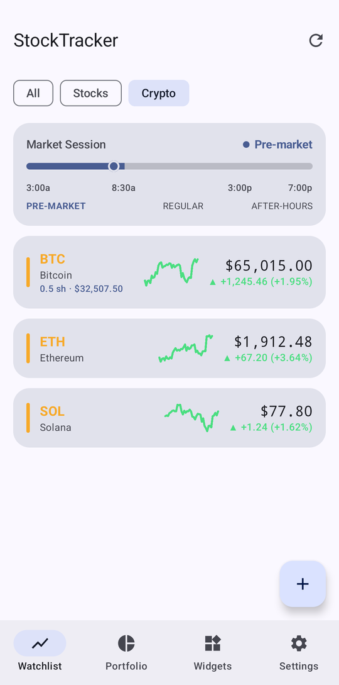
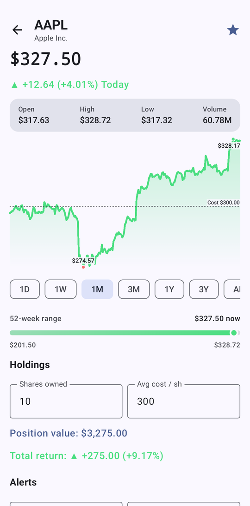
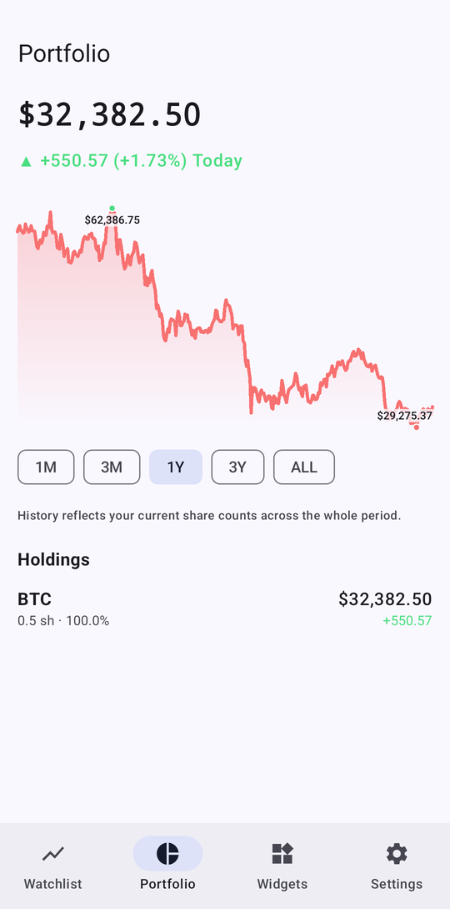
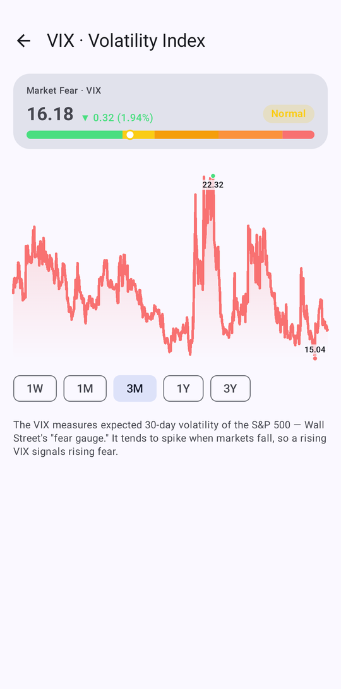
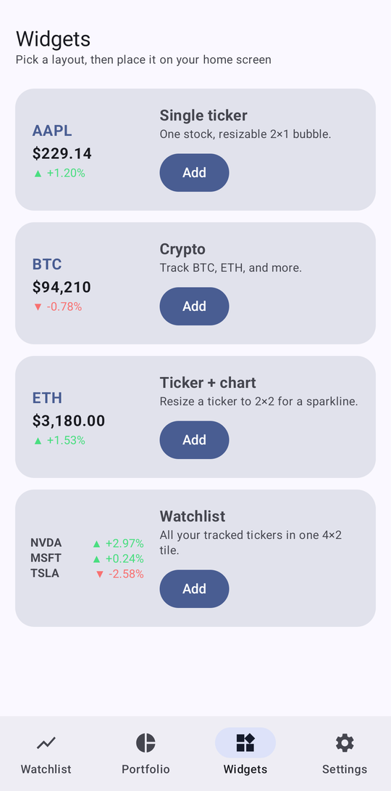

# StockTracker

Configurable Android home-screen **stock & BTC/crypto price widgets**, plus a companion app to
manage a watchlist and view charts. Each widget is a resizable "bubble" that tracks one ticker
(price, daily change, sparkline) — add as many as you like and configure each independently.

Built with Kotlin, Jetpack Compose (Material 3 / Material You), and Jetpack Glance. Pure on-device —
no backend to run. Design mockups in `.stitch-mockups/` (Google Stitch, not committed).

## Screenshots

<table>
  <tr>
    <td align="center" width="20%"></td>
    <td align="center" width="20%"></td>
    <td align="center" width="20%"></td>
    <td align="center" width="20%"></td>
    <td align="center" width="20%"></td>
  </tr>
  <tr>
    <td align="center"><sub>Watchlist — crypto accented in amber, live sparklines, market-session timeline</sub></td>
    <td align="center"><sub>Detail — chart with high/low markers, 52-week stats, 1D–3Y ranges</sub></td>
    <td align="center"><sub>Portfolio — total value reconstructed over time</sub></td>
    <td align="center"><sub>VIX "fear gauge" — tap through to the volatility history chart</sub></td>
    <td align="center"><sub>Widgets — pick a layout, drop it on your home screen</sub></td>
  </tr>
</table>

## Features

- **Home-screen widgets** (Jetpack Glance)
  - *Single ticker* — one stock or crypto, resizable 2×1 → 2×2 (shows a sparkline when larger)
  - *Watchlist* — all tracked tickers in one tile
  - Per-widget config: ticker, show change %, show sparkline, show name, accent color, refresh interval
- **App**
  - Watchlist with live prices, colored change, and sparklines (filter All / Stocks / Crypto) — crypto is accented for quick visual separation
  - Interactive ticker detail: drag-to-scrub area chart with high/low markers, optional volume, and 1D–3Y / ALL ranges; stats include 52-week high/low
  - **Portfolio** tab: set shares owned per ticker to track total value, reconstructed over time
  - **Price alerts**: above/below thresholds fire Android notifications
  - Market-session timeline on the dashboard (pre-market / regular / after-hours) — holiday-aware and in your phone's timezone
  - **VIX "fear gauge"** on the dashboard with inverse coloring + risk zones; tap through to the volatility history chart (toggle in Settings → Dashboard)
  - Search + add stocks, ETFs, and crypto
  - Material You dynamic color, light/dark/system theme
  - Finnhub API key editable in **Settings → Data** (no rebuild needed)
  - **In-app updates**: checks GitHub Releases on launch (and on demand in Settings) and installs the new APK
- Background refresh via WorkManager; last-known prices cached for offline display.
- Ticker widgets are **reconfigurable** (long-press → reconfigure on Android 12+).

## Data sources (all free)

| Data | Source | Key needed |
|------|--------|-----------|
| Stock quotes + symbol search | [Finnhub](https://finnhub.io) | Free API key |
| Crypto price, 24h change, 7d sparkline, charts | [CoinGecko](https://www.coingecko.com/en/api) | No |
| Stock history + intraday charts | Yahoo Finance chart endpoint | No |

> **Why Yahoo for stock charts?** Finnhub's free tier no longer serves historical candles. Stock
> detail charts (and widget/watchlist stock sparklines) use Yahoo Finance's public `chart` endpoint,
> which also provides intraday data (so 1D works). It is an **unofficial** endpoint and can change
> without notice; failures degrade gracefully to an empty chart. Crypto charts/sparklines come from
> CoinGecko. (Stooq was the original choice but now blocks non-browser clients behind a JS wall.)

## Setup

Get a free Finnhub key at <https://finnhub.io/register>. There are two ways to provide it:

1. **In the app (recommended, no rebuild):** open **Settings → Data → Finnhub API key**, paste it, and
   tap **Save key**. It's stored on-device (DataStore) and used immediately by the app and widgets.
2. **At build time (optional fallback):** copy `local.properties.example` → `local.properties` and set
   ```properties
   sdk.dir=/path/to/Android/Sdk
   FINNHUB_API_KEY=your_finnhub_key_here
   ```
   This becomes `BuildConfig.FINNHUB_API_KEY`, used when no in-app key is set. It is **never committed**
   (`local.properties` is gitignored) and is **not** embedded in the public debug CI artifact.

Without any key the app still works for crypto; stocks stay disabled until a key is provided. The
in-app key always takes precedence over the build-time key.

## Build

```bash
./gradlew assembleDebug          # debug APK → app/build/outputs/apk/debug/
./gradlew installDebug           # build + install on a connected device/emulator
```

Requirements: JDK 17, Android SDK with platform 35 + build-tools 35. Gradle wrapper (8.9) is included.

## Releases (CI)

- **`ci.yml`** builds a debug APK on every push/PR (artifact `stocktracker-debug-apk`).
- **`release.yml`** runs on a `vX.Y.Z` tag: builds + signs the release APK and attaches it to a
  GitHub Release.

Configure these repo secrets for signed releases:

| Secret | Purpose |
|--------|---------|
| `KEYSTORE_BASE64` | base64 of your release keystore (`base64 -w0 release.jks`) |
| `KEYSTORE_PASSWORD` | keystore password |
| `KEY_ALIAS` | key alias |
| `KEY_PASSWORD` | key password |
| `FINNHUB_API_KEY` | (optional) baked into release builds for stock quotes |

Cut a release:

```bash
# bump VERSION, then:
git tag v0.1.0 && git push origin v0.1.0
```

## Updating

The app checks `github.com/Pr0zak/stocktracker` releases on launch; if a newer `vX.Y.Z` exists it offers
to download and install the attached APK (via the system installer — requires "install unknown apps",
which Android prompts for once). You can also trigger it from **Settings → Updates → Check for updates**.
In-app updates only install cleanly over builds signed with the same release key.

## Architecture

```
app/src/main/java/com/stocktracker/app/
├── data/
│   ├── model/          Asset, Quote, PricePoint, ChartRange, SearchResult
│   ├── remote/         Finnhub / CoinGecko / Yahoo services (OkHttp + kotlinx.serialization)
│   ├── prefs/          DataStore: watchlist, settings, price cache (no Room/annotation processors)
│   └── MarketRepository combines the sources
├── di/                 ServiceLocator (tiny manual DI)
├── ui/                 Compose screens (watchlist, detail, gallery, settings, search) + theme
└── widget/             Glance widgets, config activity, WorkManager refresh, pinning helper
```

## License

MIT — see [LICENSE](LICENSE).
